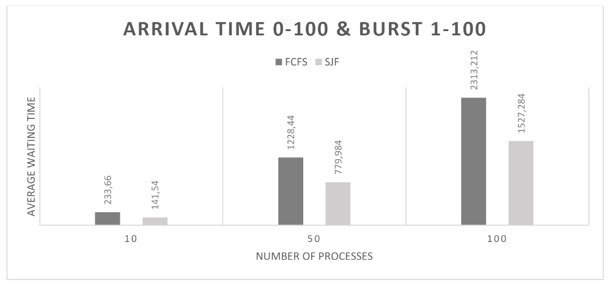

# Algorithms_simulations
**Processes simulators of replacing pages and scheduling CPU time.**
## Table of Contents

- [About the Project](#about-the-project)
- [Requirements](#requirements)
- [Usage](#usage)
- [Documentation](#documentation)

## About the Project

A program written in **Python 3** that simulates the **FIFO** (First In First Out) and **LRU** (Last Recently Used) page replacement algorithms as well as the **FCFS** (First Come First Served) and **SJF** (Shortest Job First) CPU time scheduling algorithms.

My random number **generators** allow to extract statistical data.

In the code I use **Object Oriented Programming** to store page and process objects.

You can find [documentation](#documentation) with code description and data analysis.

## Requirements

- Python 3

- IDE for Python

## Usage

Project can be used to analyze behavior of algorithms depending on the input data.

## Documentation

[Documentation and report](Report_Wiktoria_Migasiewicz.pdf)

